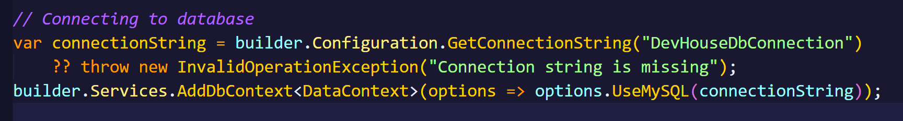

# Noroff
## Back-end Development Year 2
### BET - Course Assignment 

Classroom repository for Noroff back-end development 2 - BET Course Assignment.

Instruction for the course assignment is in the LMS (Moodle) system of Noroff.
[https://lms.noroff.no](https://lms.noroff.no)

You will not be able to make any submission after the deadline of the course assignment. Make sure to make all your commit **BEFORE** the deadline

If you are unsure of any instructions for the course assignment, contact out to your teacher on **Microsoft Teams**.

**REMEMBER** Your Moodle LMS submission must have your repository link **AND** your Github username in the text file.

---

# Application setup instructions
- Creating a new ASP .NET Core Web Api with controllers
    - Terminal command: dotnet new webpi -controllers
- Now inside the Properties/launchSettings.json, there are two properties under the "profiles" section. Delete the "http" property, so only the https property is left. This is to launch the api in https mode.

- Now to install all packages. Follow the terminal commands
    - dotnet add package Microsoft.AspNetCore.OpenApi --version 9.0.1
    - dotnet add package Microsoft.EntityFrameworkCore.Design --version 8.0.0
    - dotnet add package SwashBuckle.AspNetCore --version 7.3.1
    - dotnet add package SwashBuckle.aspNetCore.Filters --version 8.0.2
    - dotnet add package MySQL.EntityFrameworkCore --version 8.0.0
    - dotnet add package Microsoft.AspNetCore.Authentication.JwtBearer --version 9.0.3
    - dotnet add package System.IdentityModel.Tokens.Jwt --version 8.6.1

- Adding a .gitignore file with the following command
    - dotnet new gitignore

- 

# Instructions to run the application
- 

# Instructions to create needed Migrations
- In program.cs inside the builder region, add the following:
    - 
    - This is needed to connect our program to MySQL
- At the top of program.cs add the following:
    - using Microsoft.EntityFrameworkCore;
    - DevHouse.Data
- Terminal commands to create migrations
    - dotnet ef migrations add Initial -c DataContext
- Then to use these migrations and create the database
    - dotnet ef database update

# Connection String structure for MySQL Database connection
DevHouseConnectionString = "server=localhost;database=yourDatabaseNameHere;user=yourUsernameHere;password=yourPasswordHere;"

# Additional external libraries/packages used
